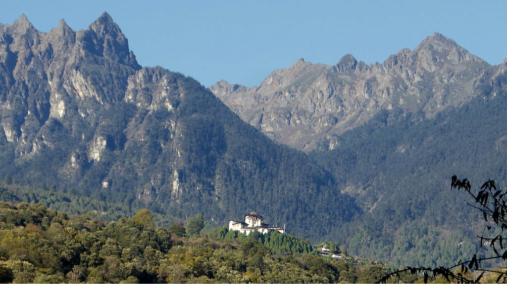
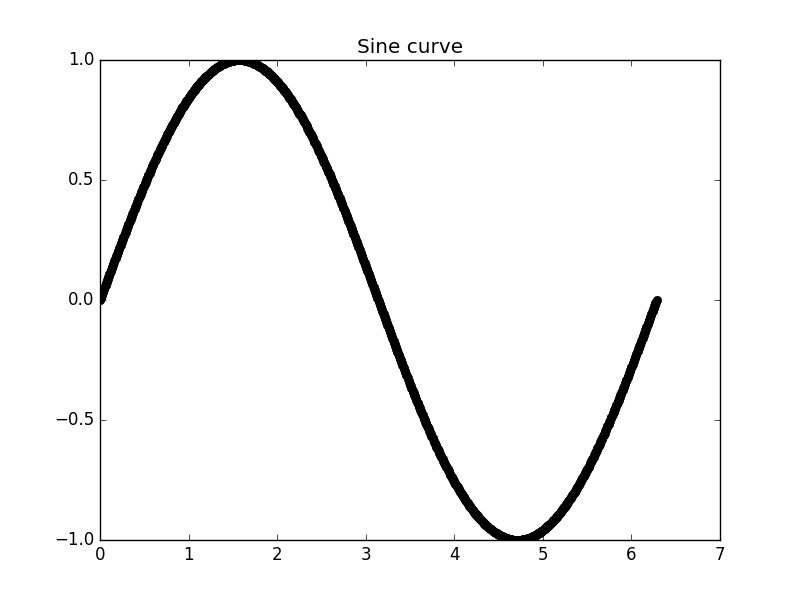

# Lab-exercise-7
This exercise is part 2 of the exercises on thermochronology. In this exercise you will modify your Python code to load a data file of measured thermochronometer ages, compare the measured ages to predicted ages from your Python code using a goodness-of-fit equation, and plot the results. The goal is to try to minimize the misfit between the predicted and measured thermochronometer ages, and quantify the long-term exhumation rates in the Bhutan Himalaya from different thermochronometers.

## Getting started
1. You can start by making a folder to store files for this week's exercises in a Terminal.

    ```bash
    $ cd Desktop
    $ mkdir Lab-7
    $ cd Lab-7
    ```
**Reminder**: the `$` symbol above represents the command prompt in the Terminal window.
2. Now you can open **Spyder**.

    ```bash
    $ spyder
    ```

Now we are ready to start.

## Overview
<br/>
*Figure 1. The Himalaya in Bhutan. [Image source](http://commons.wikimedia.org/wiki/File:View_of_Gasa_Dzong.JPG).*

The overall goal of this exercise is to interpret a thermochronometer dataset from the Himalaya of Bhutan. The interpretation entails determining long-term average rock exhumation rates from rock samples analyzed using apatite and zircon (U-Th)/He and muscovite <sup>40</sup>Ar/<sup>39</sup>Ar thermochronology. As you will recall, our exercise last week used a simple 1-D transient solution to the advection-diffusion equation to calculate a temperature-depth profile in the Earth, which was then used to predict thermochronometer ages based on Dodson's method. In that model we specified a rock exhumation rate and observed variations in the thermochronometer ages as a function of exhumation rate. This week we will compare those predicted thermochronometer ages to data from Bhutan with the goal of minimizing the misfit between the measured and predicted thermochronometer ages by varying the specified rock exhumation rate, which will allow us to define a best-fit exhumation rate (or exhumation history) for the Himalaya of Bhutan. For this exercise, we will be using data from [Coutand et al., 2014](https://dx.doi.org/10.1002/2013JB010891) and [Stüwe and Foster, 2001](https://dx.doi.org/10.1016/S1367-9120(00)00018-3) (PDFs available on the [course Moodle page](https://moodle.helsinki.fi/course/view.php?id=12453#section-4)).

## Problem 1 - Comparing measured and predicted thermochronometer ages, again
In order to be able to compare our predicted thermochronometer ages to some data, we'll first need to load the data file. You are welcome to use the [starter script file](age_predict_1D.py) to make your modifications (I have noted where to make changes), but it might be better to copy your Python script from last week and make changes to that code.

1. Using the past exercises as examples (look at those codes :smile:), you should add code to bottom your Python script (after the predicted thermochronometer ages are calculated) to read a data file and store the contents in different variables in the code. The data file has a header that lists the data contained in each column. You may want to look at the data file in a text editor in order to give logical names to the variables in the data file.
2. Once you have added the code to read the data file, you will want to calculate goodness-of-fit values for each thermochronometer system, as well as a total goodness-of-fit value for all of the age data. You should use the same goodness-of-fit equation we have used in the previous exercises, and be sure to divide the goodness-of-fit value by the number of measured ages for each thermochronometer. The goodness of fit equation you should use is

    <br/>
    where *n* is the number of ages, *O*<sub>*i*</sub> is the *i*th measured age, *E*<sub>*i*</sub> is the *i*th predicted age and *σ*<sub>*i*</sub> is the *i*th standard deviation.
    
    :heavy_exclamation_mark: **NOTE**: Be aware that measured ages are listed for each sample location in the data file, but not every sample has been analyzed for each different thermochronometer system. Thus, there are ages of '-9999' listed in the data file. Those ages are listed there to indicate there is no corresponding measured age for that thermochronometer system at that sample location. Those ages should be ignored in your goodness-of-fit calculation using an `if` statement.
3. The last task is to produce a useful plot. For this, we will again use the `plt.subplot()` command to make a plot that shows (1) the predicted geotherm and particle temperature-depth history in the upper panel (i.e., the plot from Laboratory Exercise 6), and (2) the predicted and measured age data on the lower panel.
  - For the lower plot, the *x*-axis should plot latitude and the *y*-axis should plot thermochronometer age, including error bars for the measured ages.
  - It may help to plot the different thermochronometer systems with different color symbols.
  - The predicted ages can be shown using lines of constant age that have a range that includes the entire range of latitude of the measured age data.
  - This plot should also list the goodness-of-fit values for each thermochronometer system, as well as the total goodness-of-fit for the age dataset.

## Problem 2 - "Fitting" thermochronometer data
Using the modified Python script above, you goal is now to find an average long-term exhumation rate that provides a good fit to the measured thermochronometer data.

1. Comparing the goodness-of-fit values and the plotted age data, run a series of models in which you only change the vertical advection velocity (exhumation rate) in order to find a minimum goodness-of-fit value for the whole thermochronometer age dataset. You do not need to find the absolute minimum goodness-of-fit value, but rather a value that is the minimum for some small range of exhumation rates, *v*<sub>*z*</sub> ± 0.2 mm/a. Save a copy of this plot for your final report and be sure the advection velocity (exhumation rate) and misfit value are clearly displayed on the plot.
2. Now take an alternative approach and minimize the goodness-of-fit values for each individual thermochronometer system (e.g., apatite (U-Th)/He goodness-of-fit, zircon, muscovite). As above, you do not need an absolute minimum misfit value, but one that does not decrease in the range *v*<sub>*z*</sub> ± 0.2 mm/a. You should save a copy of each plot with the minimum goodness-of-fit displayed for each thermochronometer along with the exhumation rate. You do not necessarily need to include all of these plots in your report, but you may want to include some of them.

## What to submit
**For this exercise, your modifications to the end of this document should include**

1. The 1 plot requested for problem 1 with an advection velocity of 0.5 mm/a and the 4 plots requested for problem 2.
2. Figure captions for each plot describing the plot as if it were in a scientific journal article.
4. A copy of your modified Python script used for Problems 1 and 2

**NOTE**: You may want to reference these plots in your final report on these exercises, so be sure to keep the copies of the plot files.

## References
Coutand, I., Whipp, D. M., Grujic, D., Bernet, M., Fellin, M. G., Bookhagen, B., et al. (2014). [Geometry and kinematics of the Main Himalayan Thrust and Neogene crustal exhumation in the Bhutanese Himalaya derived from inversion of multithermochronologic data](https://dx.doi.org/10.1002/2013JB010891). *Journal of Geophysical Research: Solid Earth*.

Stüwe, K., & Foster, D. (2001). [<sup>40</sup>Ar/<sup>39</sup>Ar, pressure, temperature and fission track constraints on the age and nature of metamorphism around the main central thrust in the eastern Bhutan Himalaya](https://dx.doi.org/10.1016/S1367-9120(00)00018-3). *Journal of Asian Earth Sciences*, 19(1), 85–95.

# Answers
## Problem 1
This is some text. You can use *italics* or **bold** text easily. You may want to read a bit more about [formatting text in Github-flavored Markdown](https://help.github.com/articles/basic-writing-and-formatting-syntax/). You can see an example of how to display an image with a caption below.

<br/>
*Figure 2: Sine wave calculated from 0 to 2π*
